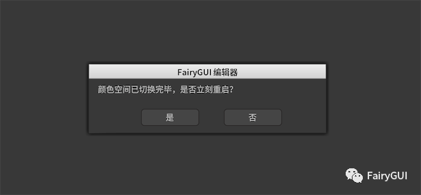
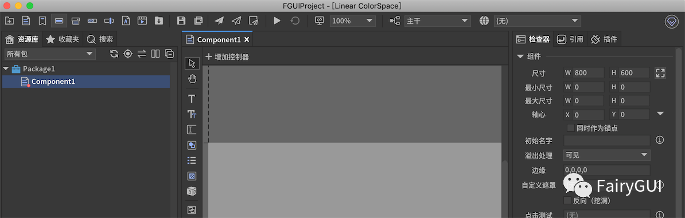

现在有不少项目选择了Linear颜色空间进行开发，而非传统的Gamma颜色空间。不同颜色空间对半透明混合的影响很大，举个例子，两张半透明图片叠加时，在Linear颜色空间和Gamm颜色空间的表现差别是很大的。但恰恰在UI制作中，这种半透明混合却并不少见。

默认情况下，FairyGUI编辑器是使用Gamma颜色空间的，当使用到半透明混合时，就会出现编辑器内效果和引擎运行效果不一致的情况。按以下操作步骤就可以将编辑器切换到Linear颜色空间：

重启后，可以看到编辑器标题栏有[Linear ColorSpace]的字样，表示编辑器现在工作在Linear颜色空间了。

颜色空间的设置是作用在编辑器的，而不是单独的项目。也就是切换后，使用这个编辑器打开任何项目都会使用相同的颜色空间。如果你有同时使用Gamma空间和Linear空间的需求，又怕每次切换麻烦，那么可以复制一份编辑器程序。