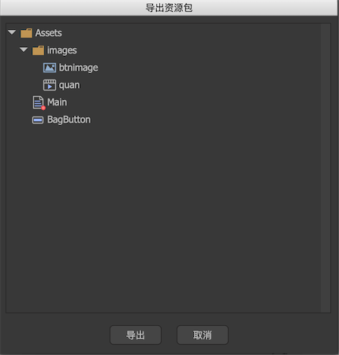
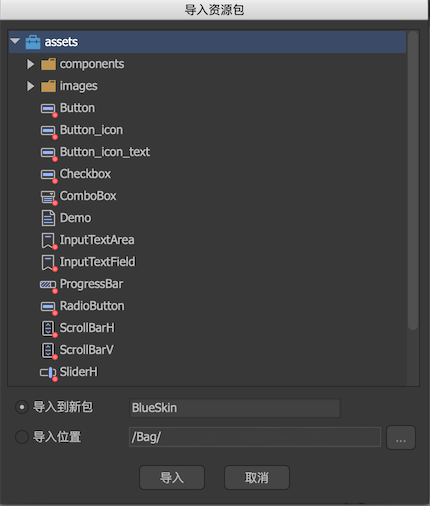

可以将部分资源导出为一个资源包，也可以导入资源包。资源包可用于分享用途。

## 导出资源包

在资源库里选定一个或者多个资源，也可以选定文件夹或包，然后点击主菜单“资源->导出资源包”：

这里列出了选定的资源以及它（们）依赖的资源，点击导出，生成一个扩展名为`fairypackage`的文件。

## 导入资源包

点击主菜单“资源->导入资源”，然后按提示选择一个扩展名为`fairypackage`的文件。

选择导入的位置，然后点击导入，fairypackage里的资源导入得到指定的位置。

## 导入内置的资源包

FairyGUI自带了几套皮肤，点击主菜单“资源->导入内置的资源包”，然后选择其中一个包导入即可。