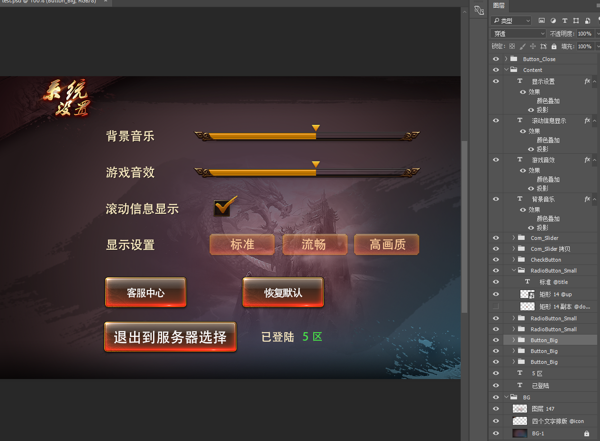

可以将部分资源导出为一个资源包，也可以导入资源包。资源包可用于分享用途。

## 导出资源包

在资源库里选定一个或者多个资源，也可以选定文件夹或包，然后点击主菜单“资源->导出资源包”：


这里列出了选定的资源以及它（们）依赖的资源，点击导出，生成一个扩展名为`fairypackage`的文件。

## 导入资源包

点击主菜单“资源->导入资源”，然后按提示选择一个扩展名为`fairypackage`的文件。


选择导入的位置，然后点击导入，fairypackage里的资源导入得到指定的位置。

## 导入内置的资源包

FairyGUI自带了几套皮肤，点击主菜单“资源->导入内置的资源包”，然后选择其中一个包导入即可。

## 从PSD中生成UI

你可以将美术制作的PSD文件导入到编辑器，直接生成UI。这个工具的名称叫psd2fgui，它是一个nodejs的应用。所以安装方式很简单，在命令行模式下运行：

```csharp
  npm install -g psd2fgui
```

等待安装完成即可。如果你的系统里还没有node的环境，那需要先从Node.js官网下载安装。

安装完成后，我们就可以直接使用psd2fgui命令了。

首先准备PSD文件：



如上图所示，使用图层名称或组名称来表达它的类型和用途。以下是约定的细节：

- 按钮 组的名称以Button开始表示这个组是一个按钮。组内的层如果名称中含有下面定义的特殊字符串（注意是包含即可，不是相同。推荐作为后缀），表示这个图层的特别含义：
  - @up 这个图层只在按钮的up状态显示
  - @over 这个图层只在按钮的over状态显示
  - @down 这个图层只在按钮的down状态显示
  - @selectedOver 这个图层只在按钮的selectedOver状态显示
  - @title 文字用作按钮的标题
  - @icon 图片用作按钮的图标

- 组件 组的名称以Com开始表示这个组是一个组件。组件可以嵌套。

然后执行转换:

```csharp
    psd2fgui test.psd
```

如果成功转换，输出为：

```csharp
    test.psd->test.fairypackage
    buildId: mlmjpf0dc7zp
```

最后使用FairyGUI编辑器，主菜单->资源->导入资源包，然后选择刚生成的test.fairypackage即可。

psd2fgui还提供了一些开关调整转换的细节。

- --nopack 不生成fairypackage。所有文件直接输出到一个文件夹中。
- --ignore-font 不使用PSD源文件中文本指定的字体名称。文本的字体均保持空白，这样在编辑器中可以应用默认字体。
- #buildId buildId是一个不少于12位的仅包含数字和小写字母的字符串。用于标识每次转换过程。使用相同的buildId，则多次转换后相同名称的资源的id不变。
  例如，使用上次转换结果的buildId重新转换：
```csharp
psd2fgui test.psd --ignore-font #mlmjpf0dc7zp
```

**定制**
目前对于PSD里结构的约定，未必能符合每个人项目的需求。遇到这种情况，可以自行修改psd2fgui的源码进行定制。源码托管在[https://github.com/fairygui/psd2fgui](https://github.com/fairygui/psd2fgui)，记得打星支持喔。