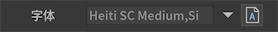
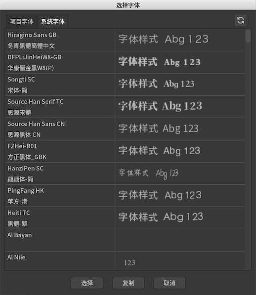
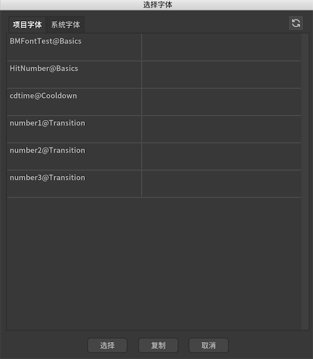
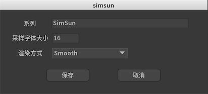
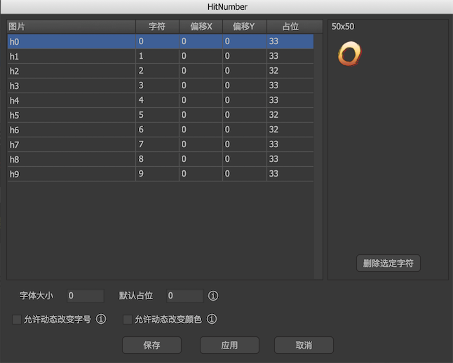

FairyGUI支持3种字体的使用方式。

## 系统字体

使用字体名称（Font Family)引用系统字体，例如'Arial'。可以在下图中的输入框直接填写字体名称，也可以在系统字体列表中选择。编辑器将在系统中查找符合名称的字体。如果没有符合的，则使用系统默认的字体。

 

点击  弹出字体选择的界面：



这里列出了当前系统中安装的字体。如果要增加新的字体，需要先安装到系统，然后点击右上角的刷新按钮。

用字体名称引用字体的方式，需要注意以下几点：

1. 本机中存在的字体未必在其他人的电脑上，或者真实的运行设备上存在，如果不存在，则字体的效果可能与预期不一致。
2. 编辑器和游戏引擎可能无法识别部分字体的名字。如果出现这种情况，可以用下述TTF字体解决。

## TTF字体

将字体文件拖入编辑器，成为字体资源，支持文件名称后缀为ttf/ttc/otf的文件。可以将字体资源拖入下图中的输入框，也可以在项目字体列表中选择。

 

点击  弹出字体选择的界面：



这里列出了项目中包含的所有字体资源。如果增加了新的资源，点击右上角的刷新按钮。

无论字体是否设置为导出，它都不会被发布。UI包发布后，引用此字体资源的文本元件的字体名称是该字体的资源名字。例如，一个文本元件，它的字体设置为Basics包的afont资源，那么发布后，它的字体属性是“afont”，而不是"ui://Basics/afont"。

那么在引擎中如何实现对afont.ttf引用呢？这需要你手动将afont.ttf放置到游戏引擎恰当的位置（这当然不需要每次发布都这样做），然后建立字体的映射。例如Unity引擎，可以通过以下代码完成：

```csharp
  //假设afont.ttf是放在Resources目录下
  FontManager.RegisterFont(new DynamicFont("afont"));
```

双击库里面的TTF字体资源，弹出以下界面：

 

- `系列` 显示字体的名称。这是只读的。
- `采样字体大小` 渲染方式为'SDFAA'时才有意义，其他渲染方式使用默认值16即可。
- `渲染方式`
  - `Smooth` 使用抗锯齿字体渲染。使用动态字体时，这是渲染字体纹理最快的模式。此模式与 macOS 上的字体渲染看起来十分相似。
  - `Hinted Smooth` 使用带有微调的抗锯齿字体渲染。这会强制字符线沿像素边界运行。通常产生比 Smooth 更清晰的输出，更类似于 Windows 上使用的字体渲染。与使用平滑模式相比，它渲染纹理的速度较慢，但对于较小字体而言可能更易于阅读。
  - `SDFAA` 使用SDF技术渲染文字。详细参考[TextMeshPro支持](#TextMeshPro支持)。

## 位图字体

在游戏中经常有这样的设计：一些表达特别元素的字符，使用了图片来制作，例如：


FairyGUI编辑器支持位图字体。首先，我们创建一种字体。点击主工具栏，然后，弹出了字体编辑窗口，我们从资源库里把制作好的数字图片拖入到窗口，并设置每个图片对应的字符，点击保存，这样我们的字体就设置好了。如果要修改每个字符对应的图片，将图片重新拖入即可。

使用图片代替字符的办法，对于少量文本，这是非常方便的，但如果需要嵌入成百上千字，为每个字制作为图片，然后再每个设置对应字符，这工作量就有点大了。FairyGUI编辑器支持外部的位图字体制作工具BMFont、ShoeBox等，这些工具的使用方法请自行参考网络资料。使用外部工具最后会导出一个fnt文件**（注意1：文件格式应该选择fnt格式，不支持xml或者json）**，在编辑器点击导入素材，然后选择这个fnt文件，就可以把字体导入到编辑器里了。

以下是推荐的BMFont导出设置：


以下介绍位图字体设置界面的功能：



- `图片` 资源库里一张图片的名字。如果是由BMFont导入的字体，则此栏为空。

- `字符` 该图片对应的字符。只支持单字符。

- `偏移X` 在水平方向上该字符的偏移。

- `偏移Y` 在垂直方向上该字符的偏移。负数表示字符上移，整数表示字符下移，但因为文字排版都是基线对齐，下移的结果可能是整行都发生下移。

- `占位` 一般来说，一个字符的水平占位宽度是由字符图片的宽度决定的。如果这里的数值不为0，则使用该值作为字符的水平占位宽度。

- `字体大小` 位图字体的字号。在勾选“允许动态改变字号”后有效。

- `默认占位` 统一设置所有字符的默认水平占位宽度。

- `允许动态改变字号` 勾选后，使用这个字体的文本可以设置字体大小使字符图片缩放。例如，先设置位图字体的“字体大小”为12，然后文本设置里设置字号为24，那么最终位图字体将放大一倍显示。如果这里不勾选，那么无论文本设置里字号为多少，位图字体都保持原样，不进行缩放。

- `允许动态改变颜色` 勾选后，使用这个字体的文本可以设置字符图片的颜色。这个改变颜色类似于改变图片元件颜色的功能。如果不勾选，那么无论文本设置里文本的颜色是什么，位图字体都保持原来的颜色。

- `纹理集` 如果字体是从BMFont导入的，那么字符图片都在一张贴图上，这里对应的是贴图资源。仅作展示，不可修改。如果你要设置该字体最终发布到哪张纹理集上，那么应该进入这个贴图图片的设置窗口设置。

## 全局字体

UI界面里需要用到大量的文本元件，如果每个文本都设置一次字体，未免太麻烦。FairyGUI提供了设置全局字体的功能。编辑器里可以在项目设置->默认值里设置。设置好后，文本元件的字体属性留空即可，这时全局字体名称将以淡灰色显示在字体属性框中。

编辑器内的设置仅在编辑器内有效，运行时的字体**则需要由代码设置**：

```csharp
    //Droid Sans Fallback是安卓上支持中文的默认字体
    UIConfig.defaultFont = 'Droid Sans Fallback'; 
```

## TextMeshPro支持

Unity里有一个TextMeshPro插件，它利用SDF(Signed-distance-field)技术渲染文字。相比常规的渲染方式，基于SDF渲染文字可无限放大并保持清晰，几乎没有开销就可实现描边，发光，抗锯齿等效果．且它只需要很小的纹理缓存SDF信息即可。FairyGUI内置支持使用TextMeshPro插件。

在FairyGUI编辑器里使用TextMeshPro的步骤如下：

1. 导入一个ttf/ttc/otf文件。
2. 双击字体，设置渲染方式为`SDFAA`，采样字体大小的选择可根据项目需求指定，这影响到一张贴图能容纳多少文字。这个值越大，渲染效果越好，但一张贴图能容纳的文字越少。一般建议值可以在30~90。
3. 对文本元件使用这个字体（或设置为全局字体）即可。

从以上步骤可以看出，在FairyGUI中可以轻松切换文本是否使用TextMeshPro。

当文本使用了TextMeshPro字体后，文本的属性会增加额外的选项，见下图：

 

自行调整一下各个属性，通过实际效果感受其作用。通常建议当描边增大时，扩张值也应该同时调大。

在Unity引擎里还需要做些特别的处理：

1. 确认安装了TextMeshPro插件。
2. 将ttf文件拖入Unity编辑器，一般放置Resources目录或者Resources/Fonts目录最简单。
3. 为ttf文件创建一个TextMeshPro FontAsset。通常，创建出来后的Asset的名字是'XXX SDF'，我们需要把名字改成'XXX‘，以便和FairyGUI编辑器里的资源名字一致。
4. 配置这个FontAsset的Sampling Point Size与FairyGUI编辑器里的采样字体大小一致。

完成这些步骤后，UI发布后，原先设定由TextMeshPro渲染的文字就能自动显示正常了。当然，如果字体需要从ab载入，那么可以用下面的方法动态注册：

```csharp
  //假设fontAsset已经从ab载入
  TMP_FontAsset fontAsset;
  TMPFont font = new TMPFont();
  font.name = 'afont'; //这个名字要和编辑器里字体资源的名字一致
  font.fontAsset = fontAsset;
  FontManager.RegisterFont(font);
```