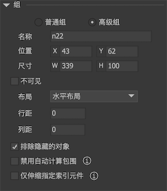

在舞台上选定一个或多个元件，然后按Ctrl+G，就可以建立一个组。 FairyGUI的组有两种类型，`普通组`和`高级组`。

## 普通组

普通组仅在编辑时有效，是辅助你进行UI设计的。普通组发布后不存在，也就是在运行时无法访问到普通组。

普通组的作用有：
1. 可以整体一起移动；
2. 可以整体一起调整深度；
3. 可以整体复制和粘贴。
4. 双击组，进入组内部后，可以随意调整各个元件的深度，不影响组外的东西。
5. 当组大小改变时，组内的内容将同时增大或者缩小。

普通组的属性面板：


- `名称` 可以给普通组取名，用途也仅仅是辅助设计。

## 高级组

高级组除了具有普通组所有的功能外，它在发布后仍然保留，也就是在运行时可以通过代码访问高级组对象。所以它可以像一个普通元件那样设置关联和属性控制。

高级组的作用有：
1. 可以设置可见性。如果组不可见，则组内的所有元件均不可见。
2. 设置属性控制。高级组支持的属性控制有：显示控制，位置控制，大小控制。
3. 设置关联。
4. 设置布局。

高级组的属性面板：



- `布局` 高级组具有简单的布局功能。
  
  - `无` 没有布局。没有布局的高级组是不会自动计算包围的，这是为了提高运行性能。因为没有布局的高级组一般只用来做显隐用途。

  - `水平布局`

    组内的元件按照他们在容器中的显示顺序水平依次排列，他们之间的间隔由列距指定。当组的宽度改变时，每个元件都**按比例增大**，然后重新排列，列距保持不变。当组内的元件自身的宽度改变时，组自动按规则重新排列。

  - `垂直布局`

    组件的元件按照他们在容器中的显示顺序垂直依次排列，他们之间的间隔由行距指定。当组的高度改变时，每个元件都**按比例增大**，然后重新排列，行距保持不变。当组内的元件自身的高度改变时，组自动按规则重新排列。

- `排除隐藏的对象`
  
  决定高级组在应用布局时，是否为隐藏的对象保留位置。如果勾选了这个选项，那么隐藏的对象就不会参与排列。

- `禁用自动计算包围`

  一般情况下，有布局的高级组是自动计算包围的，也就是说，高级组的大小由组内元素决定。勾选这个选项后，高级组的大小就可以随意指定，不再受组内元素的影响。这用于实现这样一类需求：动态建立一个高级组，设定了固定大小后，无论往组里添加多少元件，这些元件都自动伸缩，且严格按布局排列。

- `仅伸缩指定索引元件`

  一般情况下，有布局的高级组在拉伸时，组内的元素是均匀拉伸的。但在某些需求下，会要求只有一个元件拉伸，而其他元件大小保持不变。这里可以指定这样一个元件的索引实现需求。

**演示一**

这是一个无布局的组，可以看到，组大小改变时，里面的方块大小同时改变，但位置不变。


这是一个水平布局的组，可以与上图比较一下差别。


**演示二**

如果组内有设置了大小限制的元件，那么组大小改变时，这些元件的大小限制依然生效，在以下的例子中，由于左右两个色块被限制了大小，所以组变大时，只有中间的色块改变大小。


## GGroup

高级组可以在运行时通过代码访问。但要注意的是，组不是容器，它并没有维护一个组内元件的列表。如果你需要遍历组内的所有元件，你需要遍历容器组件的所有孩子，测试他们group属性。代码如下：

```csharp
    GGroup aGroup = gcom.GetChild("groupName").asGroup;
    int cnt = gcom.numChildren;
    for(int i=0;i<cnt;i++)
    {
        if(gcom.GetChildAt(i).group==aGroup)
            Debug.Log("get result");
    }
```

**必须注意，对于没有布局的高级组，运行时是不会自动改变大小的，也就是无论组内的元素怎么变动，这种高级组的大小是不会自动改变的！** 如果确实需要改变，那么只能自行调用GGroup.EnsureBoundsCorrect。
