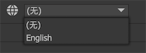

对UI多国语言的支持，FairyGUI提供了这样一种方案：把界面上的所有文字导出到一个文件，然后把这个文件提交翻译，运行时动态载入翻译好的文件，由SDK完成界面文字的替换。

也就是说，FairyGUI的方案是先拼界面，再翻译；对比先制作好语言文件，再为控件指定字符串id这种方案，显然前者在拼界面时效率更高，遇到界面需重构时前者的便利程度更加吊打后者。

编辑器导出的语言文件目前只支持xml格式，后续会支持excel等格式。xml格式可能不太方便翻译人员处理，如果需要，请参考下面xml格式的说明，自制一个excel和xml的转换工具。

## 生成语言文件

点击菜单“工具”->”字符串导入与导出”，弹出窗口如下图：


- `不导出已标记为发布时清空的内容` 例如文本，设置了发布时清空，如果这里勾选了，那么这个文本就不会出现在语言文件里。
  
- `如果导出目标文件已存在，与目标文件合并` 这个选项表示，比如现在导出内容中包含1个id为x1的字符串，值为a，而目标文件也存在一个id为x1的字符串，值为b，则导出的结果文件里，x1的值为b。

使用”导出所有字符串到文件“功能，完成后得到一个xml文件，


这个文件包含了在UI上出现的所有文字（排除了纯阿拉伯数字）。`name`是字符串的唯一id，它与界面中出现的所有文本一一对应，这个id不能破坏；`mz`是控件的名称，它仅用于提示，或者助记，底层不使用它，即使删掉也不影响。

## 在编辑器内使用语言文件

在项目设置->多国语言里，点击，然后选择上面导出的语言文件。这两个步骤也可以简化为一步，直接点击即可。

添加了一个或多个语言文件后，在主工具栏就可以切换当前界面使用的语言：



**语言文件只在预览时生效，编辑时文本内容是不会改变的**。在预览时，可以直接修改语言文件的内容，然后点击主工具栏的，就可以实时反馈你的修改，如下图：


## 代码加载语言文件

运行时动态加载语言文件：

```csharp
    //Unity
    string fileContent; //自行载入语言文件，这里假设已载入到此变量
    FairyGUI.Utils.XML xml = new FairyGUI.Utils.XML(fileContent);
    UIPackage.SetStringsSource(xml);

    //AS3
    var fileContent:String;//自行载入语言文件，这里假设已载入到此变量
    var xml:XML = new XML(fileContent);
    UIPackage.setStringsSource(xml);
```

**注意：语言文件要在创建UI前载入，不支持实时切换语言文件。如果要在游戏中切换语言，那只能先销毁所有UI，卸载所有包。**

## 全部替换

翻译好的语言文件，可以导入回编辑器，直接替换掉原来的文本内容。这适用于复制一个UI项目用于其他语言的情况。

点击菜单“工具”->”字符串导入与导出”，然后选择“从文件中导入字符串，覆盖包中的文本”。这个功能会修改掉所有文本的内容，请谨慎操作。