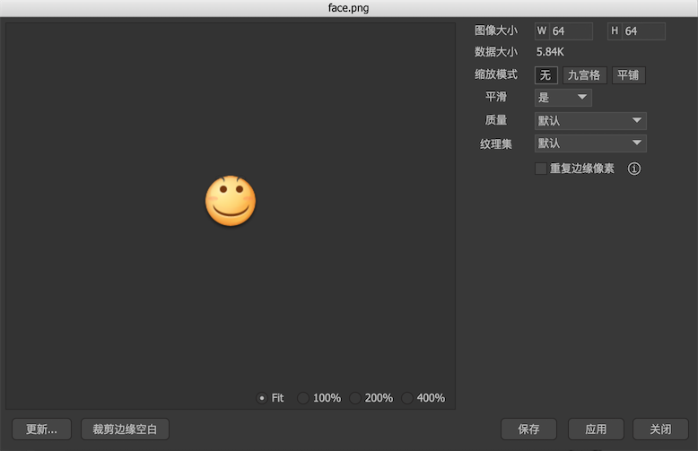
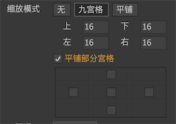
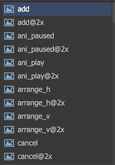
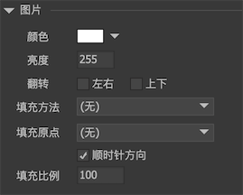

图片是FairyGUI中最基础的元素，它的设计是尽量考虑到简洁而且高效的。因此，不提供修改图片源的功能，也不支持点击。如果需要动态更改，或者支持点击，请改用装载器（如果图片已经放置在舞台，那么在右键菜单中选择交换元件，再选择装载器，就可以快捷地把图片修改为装载器了）。

FairyGUI支持的图片格式有：PNG，JPG，TGA，PSD，SVG。

## 图片属性

在资源库中，或者舞台上，双击图片，进入图片设置对话框：



- `图像大小` 图片的尺寸，像素大小。**如果图片是SVG格式，则这里是可以手工输入的。**因为SVG是可以无损缩放的，但一般游戏引擎没有提供直接支持，所以你需要为SVG指定大小，这样SVG就能像位图一样使用。

- `数据大小` 图片文件的大小，单位字节。如果出现有 xxx->xxx的字样，表示该图片被压缩过，前面数字是压缩前大小，后面的数字是压缩后大小。

- `使用九宫格进行缩放` 九宫格绘制会遵循下面的规则：
  - 保持4个角部分不变形
  - 单向拉伸4条边（即在4个角两两之间的边，比如上边，只做横向拉伸）
  - 双向拉伸中间部分（即九宫格的中间部分，横向，纵向同时拉伸，PS：拉伸比例不一定相同）

  
  （图片来自www.cocoachina.com）

  如果你想九宫格中被拉伸的部分改用平铺进行填充，可以在下图的界面内勾选"平铺部分宫格”后，再勾选需要平铺的宫格：（这个功能只有Unity等部分平台支持）

  

  **如果平台是egret，九宫格任一边都不要设置到边缘，否则显示异常。**

- `使用平铺进行缩放` 图片拉伸时使用平铺模式进行填充。除了Flash和Haxe版本，应该尽量避免使用较小面积的图片平铺填充到较大的面积，因为这样会产生大量的网格，甚至可能溢出报错。如果你确实有这个需求，Unity版本提供了一种优化策略，你需要将这个图片设置为单独导出（下面的纹理集设置会说明），然后在Unity编辑器中，将这张纹理的Wrap Mode设置为Repeat。满足这两个条件后，使用这个图片进行平铺填充的性能会大大提高，而且不会出现溢出的异常。

- `允许平滑` 它指示图片在拉伸时是否进行平滑处理。如果这个图片是用在制作像素游戏里的角色，你可能需要关闭平滑，其他情况一般都应开启。这个选项不适用于使用纹理集的平台。

- `质量` 这个选项适用于Flash和Haxe版本。你可以控制单个图片的压缩率，以便获得最优的质量空间比。改变选项后按“应用”可以立即观察到图片的变化，并在“数据大小”里观察压缩大小的成果。**这个选项不适用于Unity等使用纹理集的平台。**

- `纹理集` 一个包可以包含一张或多张纹理集，每个图片都可以安排放置到不同的纹理集。
  - `单独` 表示这个图片单独放置到一张纹理集，且纹理集的尺寸是2的幂。
  - `单独（NPOT）` 表示这张图片按原大小直接输出。
  - `单独（4的倍数）` 表示这个图片单独放置到一张纹理集，且纹理集的尺寸是4的倍数。

- `重复边缘像素` 勾选后，在纹理集里会自动将图片最边缘的像素扩充出来，以避免图片在拼接或者平铺时产生缝隙。

功能按钮：

- `更新` 选择一个外部图片覆盖此图片。

- `裁剪边缘空白` 将图片周围的全透明像素（Alpha=0）永久剪除。图片可能变小。

- `@2x` `@3x` `@4x` 如果图片是SVG格式，那么可以通过这几个功能快速为图片生成高清版本。

## 高清资源选择

做过APP开发的小伙伴应该对这个机制比较熟悉。例如我们为IPhone8设计的一套界面，分辨率是1334x750，用到一个图片a.png，这套UI到IPhone XS Max显示时，a.png就需要被放大两倍显示，放大的结果通常是比原图模糊。因此我们会准备一个a@2x.png，用作这种情况显示，使界面显示效果呈现高清的效果。

现在我们把这种机制也内置到了FairyGUI。在发布设置对话框里，我们提供了@2x，@3x，@4x的选项，勾选后，如果存在与资源同名且带@2x、@3x、@4x后缀的资源，则发布时会一并打包。运行时则根据当然界面放大系数自动选用适合的资源。这套机制全自动的，程序员无感知。唯一需要做的就是在编辑器放置好资源。



## 实例属性

在舞台上选中一个图片，右边的检查器出现：



- `颜色` 修改图片各个颜色通道的值，使图片产生变色的效果。

- `亮度` 调整图片的明暗。这个实际是通过修改`颜色`属性实现的，和设置颜色为灰阶颜色一样的效果。例如设置`颜色`为0xCCCCCC，和设置亮度为0xCC是相同的效果。

- `翻转` 将图片水平翻转或垂直翻转。与设置Scale为-1的传统翻转方法不同，这里的翻转是渲染级别的翻转，不涉及到矩阵变换，不受轴心、坐标等影响，如果需要图片翻转建议使用这里的选项。*（注：Egret、Laya、Creator版本未能实现这个特性，现在是通过设置Scale为-1实现的，如果要使用，请不要再使用Scale值，两者会冲突）*。

- `填充方法` 设置填充方法可以实现图片的一些裁剪效果。

  - `水平`  

  

  - `垂直`

  

  - `90度`

  

  - `180度`

  

  - `360度`

  

## GImage

图片我们一般不直接使用new来创建，也很少有需要单独创建图片的需求。它一般直接放置在其他组件中作为组成元素。如果确实需要实例化一个图片，可以使用以下方法：

```csharp
    GImage aImage = UIPackage.CreateObject("包名","图片名").asImage;
```

图片作为UI的一个基础组成元素，它的设计首先是考虑到简单高效，所以是不提供API修改图片的。如果有动态更改图片的需求，应该改为使用装载器（GLoader）。

如果图片设置了填充模式，可以通过代码修改填充比例，例如：

```csharp
    aImage.fillAmount = 0.5; //0~1
```

在Unity平台中，如果在某些特殊场合需要将Texture2D对象赋予给GImage，可以这样做：

```csharp
    //必须注意GImage不管理外部对象的生命周期，不会主动销毁your_Texture2D
    aImage.texture = new NTexture(your_Texture2D);
```
再次强调，这种需求仍然是建议尽量使用装载器实现。

在Unity平台中，你可以为GImage设置自定义的材质，或者着色器。例如：

```csharp
    aImage.shader = yourShader; 
    //或者
    aImage.material = yourMaterial;
```
