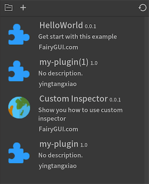
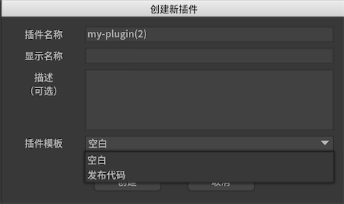

编辑器支持插件。插件可以实现对编辑器的完全控制，包括但不限于以下功能：
1. 显示自定义的视图。
2. 显示自定义的Inspector。
3. 自定义菜单。
4. 对资源的操作，如导入导出等。
5. 添加元件到舞台，以及设置舞台上的元件的属性。
6. 插入自定义操作到发布流程。例如自定义发布代码。

## 插件视图

-  打开插件放置的目录。插件目录是在“项目根目录/plugins"目录下，每个插件对应一个子目录。

-  创建一个新的插件。点击后弹出对话框：

    
    - `插件名称` 插件的名称将作为插件目录的名称。
    - `显示名称` 这里设置的值将显示在插件列表的标题中。
    - `描述` 这里设置的值将显示在插件列表的描述中。
    - `插件模板` 创建时可以使用一个模板，例如使用发布代码模板，模板里包含了自定义发布代码的整个流程，稍作修改就可以适应项目特殊的需求。

## 开发插件

从[仓库](https://github.com/fairygui/FairyGUI-Editor/tree/master/plugin)下载最新版本的插件接口和示例。

插件需要使用Lua语言开发。编辑器开放的API可以在LuaAPI目录中找到。

调试插件可以通过输出信息到控制台进行调试。