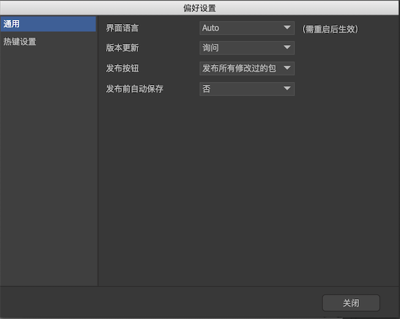
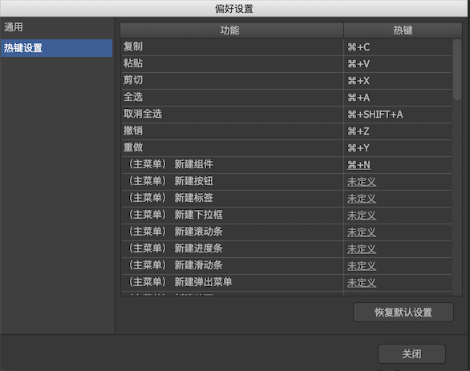

Windows用户通过主菜单“编辑->首选项”打开偏好设置对话框；
Mac用户通过主菜单“FairyGUI编辑器->首选项”打开偏好设置对话框。

## 通用

- `界面语言` 设置编辑器的界面语言。

- `版本更新` 设置是否自动更新软件。

- `发布按钮` 设置主工具栏上发布按钮的功能。
  - `发布当前包` 发布当前的活跃包（如果编辑器焦点在资源库，则活跃包是指资源库当前选中的资源所在的包；如果编辑器焦点在文档视图，则活跃包是指当前正在编辑的组件所在的包）。
  - `发布所有修改过的包` 发布当前的活跃包，以及所有修改过但未曾发布的包。
  - `发布所有包` 发布所有的包。

- `发布前自动保存` 设置发布前是否自动保存所有已修改但未保存的文档。

## 热键设置

在这里可以为常用功能指定新的热键。“复制/粘贴/剪切/全选/取消全选/撤销/重做”这些功能的热键不可修改，其他功能则可以点击热键链接修改。

编辑器对Ctrl键和Command键不做区分，他们是等效的。