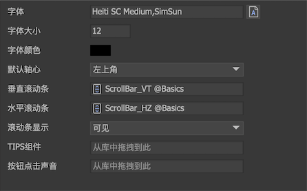
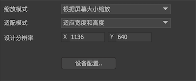

通过主菜单“文件->项目设置”打开项目设置对话框。

## 基本

- `项目名称` 在这里修改UI项目的名称。
- `项目类型` UI项目类型，即UI实际运行的平台。你可以在这里任意切换。不同的平台在显示效果、发布结果上有一定的差别。

## 默认值

**注意：这些参数是编辑器内的默认值，与运行时无关。运行时需要用`UIConfig`重新进行全局的设置。而且后者的设置也不一定需要和这里的设置相同。**

- `字体` 设置所有文本的默认字体。**可以直接输入字体名称**，也可以点击按钮选择系统中的字体。

- `字体大小` 设置在舞台中新建文本时的默认字体大小。

- `禁用字体渲染位置优化` 该选项仅适用于Egret和Laya版本。勾选后，FairyGUI将使用系统渲染文本的默认位置，不再进行自动的优化。这个差别这对于微软雅黑特别明显。这个选项可以帮助解决部分H5引擎渲染字体位置的问题。

- `字体颜色` 设置在舞台中新建文本时的默认颜色。

- `默认轴心` 可以为舞台中新放置的元件设定默认的轴心。
  - `左上角` 轴心位置在左上角，这是软件的默认设置。
  - `中心作为轴心` 轴心位置在中心。 
  - `中心作为锚点` 轴心位置在中心，且把锚点也设置为中心，也就是元件的原点在中心。

- `垂直滚动条` `水平滚动条` 设置制作UI时所有带滚动功能的容器需要使用的滚动条资源。这就是说，你将一个组件或者一个列表的“溢出处理”设置为“垂直滚动”、“水平滚动”或者“自由滚动”后，不需要每次设置滚动条，自动就会使用这里设置的滚动条资源。如果某个组件需要使用和全局设置不一样的滚动条，编辑器也提供了的单独的设置，[后面的章节](scrollpane.html)会另外说明。这个设置仅用于编辑器内，运行时使用`UIConfig.horizontalScrollBar`和`UIConfig.verticalScrollBar`设定。

- `滚动条显示` 滚动条的显示策略。这是全局设置，也可以在滚动容器属性里单独设置。 这个设置仅用于编辑器内，运行时使用`UIConfig.defaultScrollBarDisplay`设定。
  - `可见` 表示滚动条始终显示。
  - `滚动时显示` 表示滚动条只有在滚动时，或者鼠标在滚动容器视口内才会显示（PC），其他情况下则自动隐藏。
  - `隐藏` 表示滚动条始终隐藏，这种情况滚动条也不占用视口位置。

- `TIPS组件` 设定用于显示TIPS的组件。用法参考[这里](object.html#其他)。

- `按钮点击声音` 设定按钮的默认点击声音。设置后，所有按钮点击都会播放这个声效，除非按钮自己独立设置另外的声效。这个设置仅用于编辑器内，运行时使用`UIConfig.buttonSound`设定。

## 快捷菜单

- `文字大小` 一个游戏使用的字体大小通常有几种固定的方案，这里定义好后，当任何地方需要输入字体大小时，就可以直接在下拉菜单选择。

- `字体` 一个游戏使用的字体通常有几种固定的方案，这里定义好后，当任何地方需要输入字体时，就可以直接在下拉菜单选择。

- `颜色` 一个游戏使用的颜色通常有几种方案，这里定义好后，当任何地方需要输入颜色时，就可以直接在下拉菜单选择。

## 适配测试

- `缩放模式` 设置物理屏幕和逻辑屏幕的映射关系。
  - `根据屏幕大小缩放` 按适配模式对物理屏幕进行缩放，得到逻辑屏幕。
  - `不缩放` 物理屏幕与逻辑屏幕一致。

- `适配模式` 设置计算全局缩放系数的方式。当缩放模式为“根据屏幕大小缩放”才有效。
  - `适应宽度和高度` 取宽和高比例较小的进行缩放。例如，设计分辨率是960x640，设备分辨率是1280×720，那么可以得到宽边的比例是1280/960=1.33，高边的比例是720/640=1.125，最后取较小的1.125作为全局缩放系数。这种缩放方式保证内容缩放后始终在屏幕内，如果有留边，则留边部分可以通过关联系统进一步处理。这种方式是适应性很强的处理方式。
  - `适应宽度` 固定取宽的比例进行缩放，高边可能会超出屏幕，这种方式需要设计师在设计时就有目的地设计安全区域。
  - `适应高度` 固定取高的比例进行缩放。宽边可能会超出屏幕，这种方式需要设计师在设计时就有目的地设计安全区域。

- `设计分辨率` 通常我们会选择一个固定的分辨率进行UI设计和制作，这个分辨率称为设计分辨率。例如1136×640,1280×720都是比较常用的设计分辨率。选定一个设计分辨率后，最大的UI界面（通常就是全屏界面）的大小就限制在这个分辨率。

关于适配，更详细的解析请阅读[适配](adaptation.html)。

## 项目分支

-  新建分支。
-  重命名分支。
-  删除分支。

关于分支，更详细的解析请阅读[分支](branch.html)。

## 多国语言

-  增加语言文件，点击后会要求从文件系统选择一个语言文件。
-  移除语言文件，只会移除记录，不会删除实际的文件。
-  新建语言文件，点击后将创建一个新的语言文件。
-  刷新所有语言文件，这个刷新功能只对字符串进行增删，但不会做修改。这种机制保护已经翻译的内容在刷新时不会被冲掉。举例说明：
  项目内有一个组件C，它的内容是两个文本，分别是“t1:测试1，t2:测试2”，现在有一个语言文件en，它有两个字符串，分别对应了两个文本内容，并且它们已经被翻译成英文，内容为：“s1:test1，s2:test2”。观察以下操作对语言文件的影响：
  - 把t1的文本改成“测试2”，然后点击刷新。语言文件en不会有变化，s1的值依然是“test1”。
  - 把t1删掉，然后刷新所有语言文件。语言文件en里的s1会被删掉。
  - 增加一个“t3:测试3”，语言文件en的内容更新为“s1:test1，s2:test2，s3:测试3”。

关于多国语言，更详细的解析请阅读[多国语言](i18n.html)。

## 自定义属性

自定义属性是用户自定义的一些Key-Value集合。

自定义属性目前有两个用途：
1. 在插件中可以利用。
2. 控制器可以定义首页为这里的Key值，则组件创建时，控制器将自动切换到名称为Value的页面。参考[这里](controller.html#控制器设计)。

这里的设定仅用于编辑器内使用，运行时需要用代码重新设置，API是`UIPackage.SetVar`。