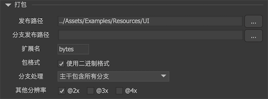
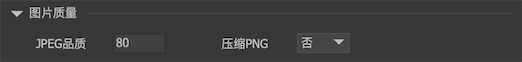
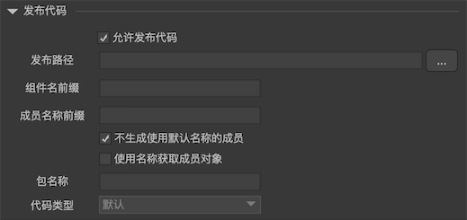
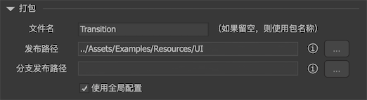
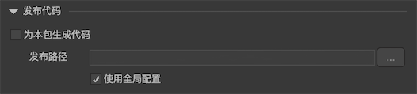
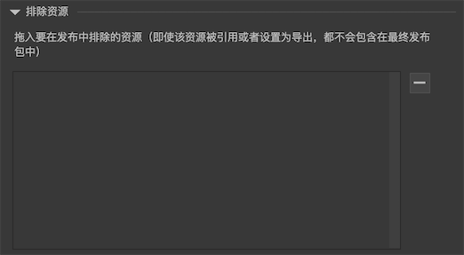

通过主工具栏按钮, 或主菜单文件->发布设置”打开发布设置对话框。


1. 包列表。
2. 切换包设置和全局设置。
3. 设置内容。
4. 功能按钮。
   - `全部发布` 发布所有包。
   - `仅发布定义` 发布包列表中当前选中的包，但仅发布定义，不重新生成纹理集。通常发布的内容包括素材（图片、声音等）和定义文件， 如果你没有增删改素材，那么你可以仅发布定义文件，避免了重新生成图集带来的时间消耗。
   - `发布` 发布包列表中选中的包。

## 全局设置

### 打包



- `发布路径` 发布结果放置的目录。发布路径支持相对于项目根目录的相对路径和绝对路径。相对路径需要手工输入，不能通过“浏览”按钮选择。**注意：如果你的UI项目同时在Windows和Mac下使用，路径分割符应该使用"/"而不是"\"**。
  
  发布路径支持使用变量，变量用中括号包围，例如：/home/zhansan/{publish_file_name}。支持的变量名：
  - `publish_file_name` 表示发布的文件名。
  - `branch_name` 表示发布的分支名。
  - “[项目设置-自定义属性](project_settings.html#自定义属性)”里定义的属性。假设自定义属性里有var1，那么路径里可以使用{var1}。

- `分支发布路径` 分支发布结果放置的目录。分支发布路径同样支持相对路径，也支持变量。

- `扩展名` 发布后描述文件的扩展名。不是所有引擎允许修改扩展名，例如Unity，固定为bytes，不能修改。对于H5类游戏引擎，小游戏不支持默认的fui扩展名，可以在这里修改为小游戏支持的扩展名（自行查阅小游戏文档）。

- `两个压缩包` 可以选择打包成一个压缩包或者两个压缩包。这个选项只有Flash引擎可用。“两个包”表示将XML定义和图片等资源分开。这样做的好处是如果只修改了组件，没有加入新的素材或删除素材，则可以只发布和推送定义包给用户，减少用户的流量消耗。

- `使用二进制格式` 编辑器从3.9.0版本起，支持了新的发布格式，即二进制格式。和以往使用的XML格式不同，二进制格式更加紧凑，解析时更快，而且占用的内存和产生的内存垃圾更少。除非是旧项目无法升级，一般都建议勾选二进制格式。

- `压缩描述文件`  Laya/Egret/CocosCreateor项目提供了这样一个发布选项，通过此选项可以控制发布的描述文件是否压缩。默认是压缩的。如果你已经使用了web服务器的gzip压缩功能，又或者是打包时会自行压缩（例如小游戏），那可以选择不压缩的格式，避免重复压缩。

- `分支处理` 发布过程中分支的处理方式。详细用法请参考[分支](branch.html)。

- `其他分辨率` 勾选允许同时发布的高清素材后缀。例如，如果资源库中存在a.png和a@2x.png，如果勾选了“@2x”，那两个文件都会发布；如果没有勾选，则只有a.png会发布。这个选项会同时影响适配测试，也就是说这里勾选了选项，适配测试里也会自动使用合适的高清资源。

### 纹理集


- `最大尺寸` 限制纹理集的最大尺寸，一般选择2048即可。

- `超出后自动分页` 当一张纹理集容不下所有图片，自动创建多个分页。例如，如果一张纹理集能容纳下所有图片，那么得到的文件是atlas0.png；如果不能容纳下，那么得到的文件是atlas0_1.png,atlas0_2.png...。

  **注意：纹理集分页和多个纹理集的概念不同。多个纹理集是指用户自行划分纹理集；分页是指单个纹理集超出负荷时自动分页的机制。**

  使用自动分页时，有一个特别的问题需要注意：**动画和位图字体不支持纹理分页，也就是说，当纹理设置了自动分页时，如果动画或者位图字体被分布到不同的纹理集页面，发布时就会提示错误。这时你可以安排动画放置到单独的纹理集，或者和其他动画放在同一个纹理集上。**

- `尺寸选项` 当纹理集需要压缩为特殊格式，例如ETC，ETC2时，通常对纹理集尺寸有特殊要求。
  - `2的n次幂` 限定输出纹理集的尺寸为2的n次幂，例如256，1024，2048这样。
  - `4的倍数` 限定输出纹理集的尺寸为4的倍数。
  - `不限制` 不限制输出纹理集的尺寸。

- `正方形` 勾选后，限制输出纹理集的宽和高相等。

- `允许旋转` 允许旋转图片以达到更大的纹理集空间利用率。

- `裁剪图片边缘空白` 发布时自动将图片周边的全透明像素剪裁，这个功能对开发者是透明的，不影响图片的正常使用。高版本的SDK才支持，如果你已经升级了SDK，建议开启此选项提高纹理集空间利用率。

### 图片质量



仅在不使用纹理集的平台（例如Flash平台、Haxe平台）可见。由于这类平台发布后都是单独的图片，可以在这里指定图片的默认质量。图片的质量也可以单独指定，在资源库里双击图片进行设置。

- `JPEG品质` JPEG品质，0-100。

- `压缩PNG` 是否将PNG图片压缩为PNG8。

### 发布代码



- `允许发布代码` 是否生成绑定的代码。生成绑定的代码可以更直观地访问组件的各个节点，但会造成美术工作和程序员工作的耦合。

  包设置里也有允许发布代码的开关。如果这里不勾选，那么所有包都不会发布代码。如果这里勾选，那么由包设置的开关决定该包是否发布代码。

- `发布路径` 发布的代码保存的路径。发布路径支持相对路径和绝对路径，也支持变量。

- `组件名前缀` 给每个组件生成的类名加上前缀。例如如果组件名为“Component1”，这里设置前缀为“T”，那么最后生成的类名为“TComponent1”。前缀可以为空。注意，如果组件名是中文，会被自动转换为拼音。

- `成员名称前缀` 给组件里每个元件的名称前加上前缀。例如如果元件名称为“n10”，这里设置前缀为“m_”，那么最后生成的类成员的名称为“m_n10”。前缀可以为空，但不建议这样做。因为元件名称很可能和类的一些属性和方法名称冲突。例如，如果元件名称为“icon”，那就和GObject的icon属性冲突了。

- `不生成使用默认名称的成员` 勾选后，对于"n1","n2"等这种系统自动生成的名称，或者“title”，“icon”等这种扩展组件里约定的名称，将不会为这些名称的元件生成成员获取代码。如果一个组件里，全部都是这些名称的元件，那么整个组件都不会生成代码。例如，一个按钮，里面只有名称为“title”和“icon”的元件，则不会为这个按钮生成代码，因为使用基类GButton已经足够。

 - `使用名称获取成员对象` 如果不勾选，组件初始化时使用索引获得子对象；如果勾选，则使用名称获得子对象。前者效率高，推荐使用；后者则兼容性较好，例如，如果调整了元件的顺序，不会发生异常。

- `包名称` 对于AS3代码，是指发布的代码的package；对于C#代码，是指发布的代码的namespace；对于Typscript代码，是指发布的代码的module；对于C++代码，是指发布的代码的namespace。

发布出来的代码包含一个XXXBinder文件和多个类文件。注意：
1. **在使用绑定类之前，一定要调用`XXXBinder.BindAll`，并且在创建任何UI之前调用。**
2. **使用绑定类创建UI的API是`CreateInstance`，不能直接new。**

举例：
```csharp
    //首先要调用BindAll。发布出来的代码有个名字为XXXBinder的文件
    //注意：一定要在启动时调用。
    XXXBinder.BindAll();

    //创建UI界面。注意：不是直接new XXX。
    XXX view = XXX.CreateInstance();
    view.m_n10.text = ...;
```

## 包设置

### 打包



- `文件名` 包的发布文件名。这个文件名与包名称可以不同，如果这里留空，那么使用包的名称。**当我们载入包时，需要使用这里设定的文件名，而当创建对象时，需要使用包名称**。例如

```csharp
    //这里的file_name是发布的文件名。
    UIPackage.AddPackage('file_name'); 

    //这里的Package1是包的名称。
    UIPackage.CreateObject("Package1','Component1'); 
```

- `发布路径` 发布结果放置的路径。参考全局设置。

- `分支发布路径` 分支发布结果放置的路径。参考全局设置。

- `使用全局配置` 如果勾选，`发布路径`和`分支发布路径`都使用全局配置里的设置，本页面的设置无效。

- `两个压缩包` 可以选择打包成一个压缩包或者两个压缩包。这个选项只有Flash和Haxe平台可用。参考全局设置。

### 纹理集


- `使用全局配置` 如果勾选，纹理集设置都使用全局配置里的设置，本页面的设置无效。参考全局设置。

- `分离Alpha通道` 这个选项仅适用于Unity平台。通过此方法，可以在Unity里将原纹理集设置为不支持Alpha通道的格式（例如ETC1）以减少内存占用。FairyGUI-unity SDK提供了专门的着色器进行混合。

点击“纹理集定义”按钮，显示如下对话框：


对于支持纹理集的平台，你可以规划图片放到不同的纹理集内。这项功能的意义在于：
- 图片太大太多，假设纹理集最大支持2048×2048（这个可调整），超出此范围则需要用到多个纹理集；
- 图片用途不一致，例如一张尺寸比较大的色彩丰富的背景图就不适合和色彩比较单一的UI素材放到一起，这样会使最终发布的png图片过大。将超大尺寸背景图单独放一张纹理集是一个比较好的解决方案；
- 图片的特性不一致，例如在Unity平台里，你可以为纹理集设置单独的Filter Mode、压缩格式等等。

左边视图是纹理集列表，默认定义了编号从0至10共11张纹理集。

右边视图是选中纹理集包含的资源。

- `纹理集最大编号` 如果有需要，修改这里的数值，扩充纹理集数量。

- `压缩PNG` 将纹理集使用PNG8格式压缩。这个压缩方式能大大降低PNG文件大小，但也会使图片失真比较严重，特别是色彩比较丰富，或者含有渐变的图片，请谨慎使用。Unity引擎不要使用这个压缩功能，因为Unity对纹理集的压缩应该在Unity里设置，Unity在打包时会自动根据设置的格式压缩纹理集，使用这里的压缩除了降低图片质量外没有任何减少文件体积的作用。

### 发布代码



- `为本包生成代码` 为本包生成代码。生成代码的作用请参考全局设置。注意，即使这个勾选了，如果全局设置里没有勾选，最后也不会生成代码。

- `发布路径` 发布结果放置的路径。参考全局设置。

- `使用全局配置` 如果勾选，`发布路径`使用全局配置里的设置，本页面的设置无效。

### 资源排除设置



如果一些素材，只用于测试用途，例如一个装载器，放一个图片进去只用于看效果，但这个图片是不随包发布的（后续可能通过外部加载），那么可以在这个界面里将这个图片拖入，那么发布时就不会包含这个图片了。

## 命令行发布

除了在编辑器内点击发布按钮发布外，还支持通过命令行发布。(仅适用于2020版本的专业版编辑器）

```csharp
FairyGUI-Editor -batchmode -p project_desc_file [-b package_names] [-t branch_name] [-o output_path] [-logFile log_file_path]
```
- `batchmode` 必选。指示编辑器在后台执行命令。
- `project_desc_file` 必选。项目描述文件路径，例如d:\a\1.fairy。
- `package_names` 可选。不提供则为所有包，多个包用逗号隔开。如果你是通过插件自定义发布的，那么这里传一个"-"，就能避免默认的发布。
- `branch_name` 可选。分支名称。不提供则发布主干。
- `output_path` 可选。如果指定，则覆盖项目里的设置，直接使用这里指定的位置。
- `logFile` 可选。指定一个日志文件。
