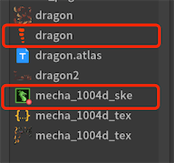

FairyGUI编辑器支持导入骨骼动画，目前支持的格式为：

- Spine 只支持3.8版本。json格式和二进制格式都支持。
- 龙骨 支持所有版本。json格式和二进制格式都支持。

导入骨骼动画，只需将描述文件导入即可，**不需要拖入atlas描述文件或者贴图。**。即导入

- Spine xxx.json/xxx.skel
- 龙骨 xxx.json/xxx.dbbin



上图第一个红框中的资源是Spine动画资源，第二个红框中的资源是龙骨动画资源，请认准它们的图标。设置导出，拖入舞台等操作只对这两种资源执行即可，**其他同时导入的资源不需要处理，更不要设置为导出。**

骨骼动画发布时会保留原来的文件名，这与纹理集发布的策略不一样。纹理集发布时通常会带上前缀，例如，如果包的文件名是abc，则会发布出abc_atlas0.png这样的图片文件。但骨骼动画不会带这样的前缀。例如，如果骨骼动画相关的文件有hero.json、hero.atlas、hero.png，则发布后这3个文件会原样拷贝到发布路径中。

## 在Unity中使用

- 使用Spine
  1. 安装Spine Runtime 3.8版本。
  2. 进入Unity编辑器，在Script define symbols里增加: `FAIRYGUI_SPINE`。
  3. 发布UI后，直接运行就能看到UI编辑器里放置好的Spine动画。

- 使用龙骨
  1. 安装龙骨SDK for Unity。
  2. 进入Unity编辑器，在Script define symbols里增加: `FAIRYGUI_DRAGONBONES`。
  3. 发布UI后，需要手动在Unity里为龙骨资源创建Unity Data，操作见下图：
   
    

  4. 运行后就能看到UI编辑器里放置好的龙骨动画。

## 在Egret中使用

Egret运行时只支持载入龙骨，Spine需要先转换成龙骨才能使用。

发布UI后，在Egret的资源配置文件里（default.res.json)应该有以下几个项目：

```csharp
    {
        "url": "assets/UI/mecha_1004d_ske.json",
        "type": "json",
        "name": "mecha_1004d_ske_json"
    },
    {
        "url": "assets/UI/mecha_1004d_tex.json",
        "type": "json",
        "name": "mecha_1004d_tex_json"
    },
    {
        "url": "assets/UI/mecha_1004d_tex.png",
        "type": "image",
        "name": "mecha_1004d_tex_png"
    }
```

配置好后，运行就能看到UI编辑器里放置好的龙骨动画。

## 在Laya中使用

Laya引擎不能直接解析Spine或龙骨的数据文件，需要先转换成它支持的sk格式文件。

1. 发布UI。
2. 使用Laya的骨骼动画工具转换发布出来的数据文件。
3. 原始数据文件可以删除。
4. 运行后就能看到UI编辑器里放置好的Spine或龙骨动画。

## 在CocosCreator中使用

发布UI后，直接运行就可以看到UI编辑器里放置好的Spine或龙骨动画。