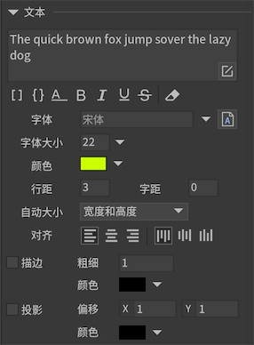
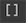
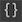

文本是FairyGUI的基础控件之一。文本不支持交互，鼠标/触摸感应是关闭的。

## 实例属性

点击主工具栏中的按钮，生成一个文本元件。



-  设置文本支持UBB语法。使用UBB语法可以使单个文本包含多种样式，例如字体大小，颜色等。请参考[UBB语法](text.html#UBB语法)。*（Laya/Cocos2dx版本不支持普通文本里包含多种样式，如果有这个需求，请改用富文本）*

-  选中后，文本可以使用{count=100}这样的语法表达一个文本参数。请参考[文本模板](text.html#文本模板)。

-  设置文本为单行。单行文本不会自动换行，换行符也被忽略。

-  设置文本为粗体。

-  设置文本为斜体。

-  设置文本为下划线。

-  设置文本为删除线。注意，只有部分引擎支持。

-  表示文本只用作编辑器预览用途，发布时将会自动清除。

- `文本` 设置文本内容。当需要换行时，在编辑器里可以**直接按回车**。用代码赋值时需要换行可以用“\n”。

- `字体` 设置文字使用的字体。如果留空，表示使用全局设置字体（这时全局字体名称将以淡灰色显示）。详细请参考[字体](font.html)。

- `字体大小` 设置文字使用的字号。**如果使用的是位图字体，你需要对位图字体设置“允许动态改变字号”，这里的选项才有效。**

- `颜色` 设置文字颜色。**如果使用的是位图字体，你需要对位图字体设置“允许动态改变颜色”，这里的选项才有效。**

- `行距` 每行的像素间距。

- `字距` 每个字符的像素间距。*（目前H5类引擎均不支持）*

- `自动大小` 
  - `自动宽度和高度` 文本不会自动换行，宽度和高度都增长到容纳全部文本。
  - `自动高度` 文本使用固定宽度排版，到达宽度后自动换行，高度增长到容纳全部文本。
  - `自动收缩` 文本使用固定宽度排版，到达宽度后文本自动缩小，使所有文本依然全部显示。如果内容宽度小于文本宽度，则不做任何处理。 *(位图字体要在字体属性里勾选'允许改变字号'才能使用自动收缩特性)*
  - `无` 文本使用固定宽度和高度排版，不会自动换行。

- `对齐` 设置文本的对齐。

- `单行` 设置文本为单行。单行文本不会自动换行，换行符也被忽略。

- `描边` 设置文本的描边效果。描边粗细数值不能过大，否则效果会比较奇怪。描边在各个引擎实现的方式不同，效果也不同，编辑器的效果也仅供参考。

- `投影` 设置文本的投影效果。投影效果可以看做是简化的描边效果，描边是所有方向，投影只有一个方向。投影和描边共用一个颜色设置。

## GTextField

文本支持动态创建，例如：

```csharp
    GTextField aTextField = new GTextField(); //LayaAir平台用new GBasicTextField
    aTextField.SetSize(100,100);
    aTextField.text = "Hello World";
```

动态改变文本的样式（字体大小、颜色等），在不同的平台，方式略有差别：

```csharp
    //Unity/Cry
    TextFormat tf = aTextField.textFormat;
    tf.color = ...;
    tf.size = ...;
    tf.font = ...;
    aTextField.textFormat = tf; //或者 aTextField.ApplyFormat();

    //Cocos2dx
    TextFormat* tf = aTextField->getTextFormat();
    tf->color = ...;
    tf->size = ...;
    tf->font =  ...;
    aTextField->applyTextFormat();

    //其他平台
    aTextField.color = ...;
    aTextField.fontSize = ...;
    aTextField.font = ...;
```

如果要设置文本的字体为位图字体，字体名称直接使用字体的url就可以了，例如‘ui://包名/字体名’。

## UBB语法

FairyGUI支持的UBB语法有：

- `[img]image_url[/img]` 显示一个图片。这里的image_url可以是"ui://包名/图片名"的内部url格式，也可以是一个外部资源的url。图片最终是通过GLoader显示的，支持外部资源的能力可以参阅GLoader的文档。在这里，你无法设置图片大小。如果需要需要设置图片大小，改用HTML语法。

- `[url=link_href]text[/url]` 显示一个超级链接。其中link_href可以在链接点击后触发的事件里获得。

- `[b]text[/b]` 设置文本为粗体。

- `[i]text[/i]` 设置文件为斜体。

- `[u]text[/u]` 设置文本为下划线。

- `[sup]text[/sup]` 设置文本为上标。*（部分引擎支持）*

- `[sub]text[/sub]` 设置文本为下标。*（部分引擎支持）*

- `[color=#FFFFFF]text[/color]` 设置文本颜色。注意一定要用十六进制颜色代码，像red、blue这种颜色名称是不支持的。使用color语法还可以设置文本颜色为渐变色*（部分引擎支持）*，例如：

    ```csharp
        //指定两个颜色表示上下过渡
        [color=#FFFFFF,#000000]文字[/color]

        //指定四个颜色可以做左右过渡或者双方向过渡
        [color=#FFFFFF,#CCCCCC,#000000,#FFFF00]文字[/color]
    ```

- `[font=font_face]text[/font]` 设置文本的字体。

- `[size=10]text[/size]` 设置文本的字体大小。

- `[align=left/center/right]text[/align]` 设置文本的水平对齐。*（部分引擎支持）*

标签之间支持嵌套，但不支持交叉嵌套。例如：

```csharp
    //允许
    [color=#FFFFFF][size=20]text[/size][/color]

    //不允许
    [color=#FFFFFF][size=20]text[/color][/size]
```

对不支持的标签，例如“[tag]text[/tag]”，FairyGUI不做解析，这部分内容原样输出。当“[”字符要用于非UBB语法时，可以使用"\\["这样的方式转义，注意，在编辑器输入时是直接输入"\\"即可，在代码里需要用"\\\\"这样才能表达反斜杠。另外，只需转义"["，不需要转义"]"。

**普通文本不支持语法中的img、url标签，因为普通文本是不可以图文混排的。要支持图文混排，改为使用富文本。**
 
FairyGUI也提供了扩展UBB解析器的方法。继承UBBParser类，注册自己的TagHandler即可。具体实现方法请阅读UBBParser的源码或参考demo。

## 文本模板

使用文本模板可以更灵活的动态调整文本输出。例如，如果需要显示“我的元宝：100金200银”，那么常见的制作方式有：
1. 使用一个文本控件显示，那么运行时程序员要改变数值时只能整个文本重新打一遍，这无疑是一个冗余的工作量，且不利于美术和程序解耦。
2. 使用四个文本控件显示，那么运行时程序员只需要改变显示数值的文本控件即可，但美术的工作量增大。

使用文本模板功能，可以轻松解决这种需求。只需要在编辑器放置一个文本控件，文本为“我的元宝：{jin=100}金{yin=200}银”，然后勾选“使用文本模板”即可。这样在编辑器中显示依然是“我的元宝：100金200银”，运行时程序员只需要执行以下的代码就可以更新数值：

```csharp
    aTextField.SetVar("jin", "500").SetVar("yin", "500").FlushVars();
```

也可以批量设置：

```csharp
    Dictionary<string, string> values;
    values["jin"] = "500";
    values["yin"] = "500";
    //注意，这种方式不需要再调用FlushVars
    aTextField.templateVars = values;
```

如果运行时要动态启用文本模板功能，不需要设置什么开关，只需要直接调用SetVar即可。
如果运行时要动态关闭文本模板功能，只需要把templateVars设置为null即可，即：

```csharp
   aTextField.templateVars = null;
```

当“{”字符不是用于模板时，可以使用"\\{"这样的方式转义，注意，在编辑器输入时是直接输入"\\"即可，在代码里需要用"\\\\"这样才能表达反斜杠。另外，只需转义"{"，不需要转义"}"。

文本模板优先于UBB解析，所以模板也可以在UBB中使用，例如文本为：“这个是可以变色的[color={color=#FF0000}]文本[/color]”，可以方便的实现动态更改部分文本颜色的需求。