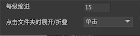
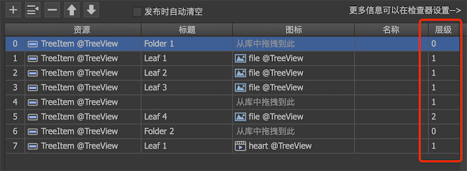

树是列表的一种特例。是组件的一种特殊扩展。勾选列表属性的，使列表变成一棵树。

## 树属性

点击树视图右侧的按钮显示如下界面：



- `每级缩进` 树节点的深度每增加一级，向右缩进的像素距离。例如，如果每级缩进是15像素，树节点的层级是3级，那么树节点的缩进是15*3=45像素。
  
- `点击文件夹时展开/折叠` 点击文件夹节点时是否自动展开或者折叠这个这个节点。
  - `否` 没有动作。
  - `单击` 在单击时动作。
  - `双击` 在双击时动作。

激活树视图后，编辑列表项目的界面也有了变化，如下图：



最右侧增加了“层级”设置。顶层节点为0级，增加一级则表示是上一级的子节点。

参考下图，层级与节点的对应关系：


## 树节点设计

树节点设计有几个约定的规则：

1. 名称为`expanded`的控制器（可选）。如果节点是文件夹节点，当节点展开时，这个控制器自动切换页面到1；当节点折叠时，自动切换页面到0。你可以使用此控制器控制节点在这两种状态下的形态。
   如果树节点内有放置按钮（这个按钮应该是复选按钮）用于展开和折叠，那么应该将这个按钮和控制器连接，如下图：

   

2. 名称为`leaf`的控制器（可选）。如果节点是文件夹节点，那么这个控制器的页面是0；如果节点是叶节点，那么这个控制器的页面是1。你可以使用此控制器控制这两种不同类型节点的形态。

3. 名称为`indent`的对象将用于设置缩进（可选）。假设某节点的缩进是45像素，那么indent对象的宽度会被设置为45。

## GTree

当一个列表激活树视图后，它在代码中的对象就是GTree。GTree继承自GList，所以GList的所有API也适用于GTree，不过GTree目前**不支持虚拟化**。

```csharp
GTree aTree = aComponent.GetChild("tree").asTree;
GTreeNode rootNode = aTree.rootNode;
```

这里rootNode是树的根节点，它是一个“假”的节点，不可见。

创建并添加节点：

```csharp
GTreeNode aNode = new GTreeNode(true); //true表示文件夹节点，false表示叶节点
rootNode.AddChild(aNode);
```

渲染节点的方式有两种：

1. 直接操作节点对应的组件。
    ```csharp
    GComponent obj = aNode.cell;
    obj.GetChild("abc").text = "hello";
    ```
    **这种方式一定要是节点已经在树里了才能使用，也就是已经AddChild了**。

2. 通过回调函数操作。
    ```csharp
    aTree.treeNodeRender = RenderTreeNode;

    void RenderTreeNode(GTreeNode node, GComponent obj)
    {
    }
    ```

响应树节点点击，和列表响应item的处理方式一样，都是监听`onClickItem`事件，可以参考[这里](list.html#事件)。在得到点击的item对象后，要获得其对应的GTreeNode对象，可以用API`GObject.treeNode`获得。

GTree还有一个特别的回调：`treeNodeWillExpand`，它在TreeNode即将展开或者收缩时回调触发。你可以在回调中动态增加子节点。

```csharp
aTree.treeNodeWillExpand = onExpand;

void onExpand(GTreeNode node, bool expand)
{
}
```

